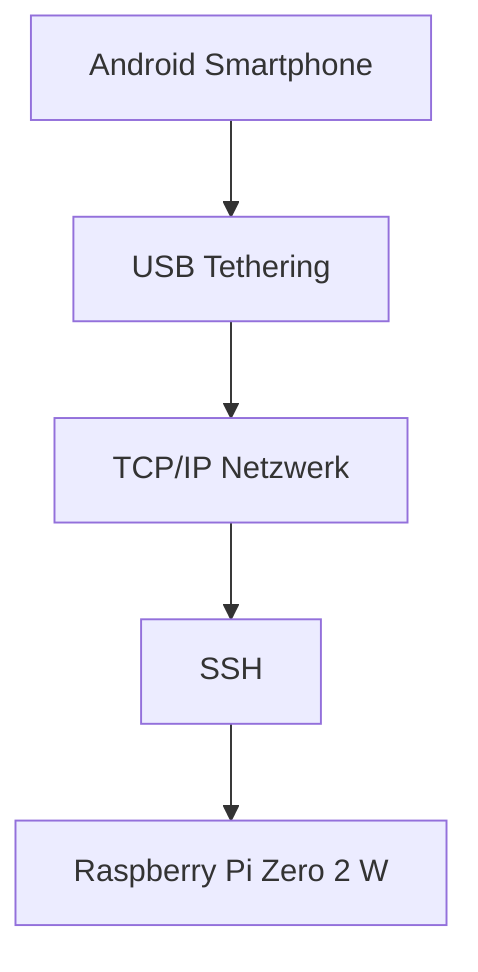
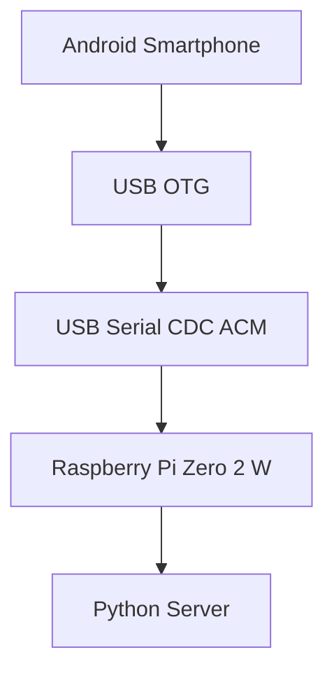
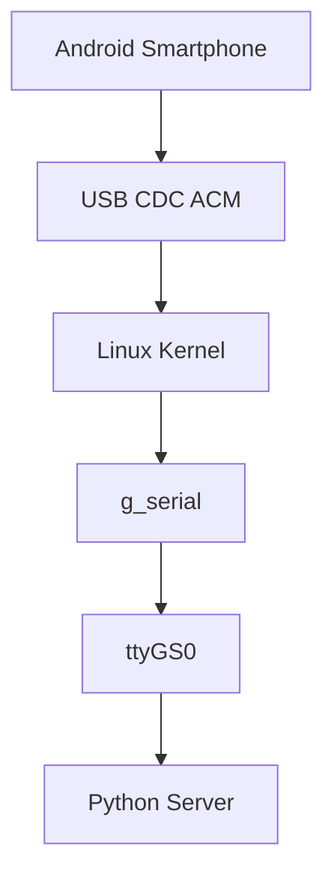
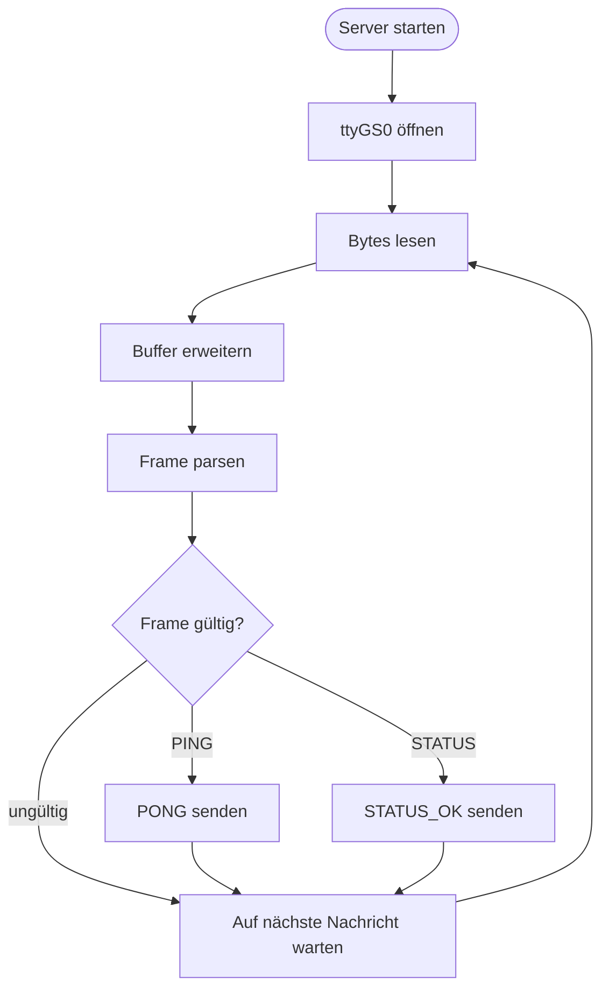
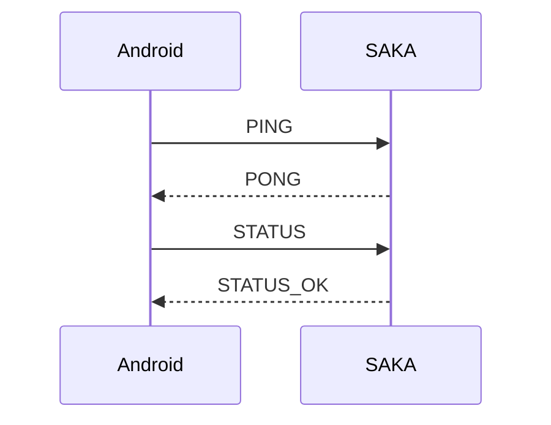

# USB-Serial-Kommunikation zwischen Android und Raspberry Pi Zero 2 W (SAKA)

## Proof of Concept zur Ablösung einer SSH-Verbindung durch USB-Serial

---

**HTW Berlin**

Fachbereich 4 – Informatik, Kommunikation und Wirtschaft

**Modul:** Dezentrale Systeme – Projektstudium SharkBox / SAKA

**Autor:** Denis Olf

**Semester:** Sommersemester 2026

**Dozent:** Prof. Dr. Schwotzer

**Version:** 1.0

---

# Inhaltsverzeichnis

1. Einleitung
2. Motivation
3. Projektziel
4. Ausgangssituation
5. Grundlagen
6. Projektarchitektur
7. Hardware
8. Software
9. Konfiguration des Raspberry Pi
10. Android-Konfiguration
11. Kommunikationsprotokoll
12. Python-Server
13. Testdurchführung
14. Testergebnisse
15. Retrospektive
16. Fazit
17. Glossar
18. Anhang

---

# 1 Einleitung

Im Rahmen des Projektstudiums **SharkBox / SAKA** sollte untersucht werden, ob sich die bisher verwendete SSH-Kommunikation durch eine direkte USB-Serial-Verbindung ersetzen lässt.

Die bisherige Kommunikation zwischen Smartphone und Raspberry Pi erfolgte über USB-Tethering und SSH. Obwohl diese Lösung funktionierte, besitzt sie mehrere Nachteile. Es muss zunächst eine Netzwerkverbindung aufgebaut werden, anschließend erfolgt die Anmeldung per SSH. Erst danach können Befehle übertragen werden.

Für viele Anwendungsfälle einer Hardware-Wallet oder eines sicherheitskritischen Embedded Systems ist dieser Weg unnötig komplex.

Ziel dieses Projektes war deshalb der Nachweis, dass ein Android-Smartphone den Raspberry Pi Zero 2 W direkt über eine USB-Serial-Schnittstelle steuern kann, ohne dass eine Netzwerkverbindung oder SSH erforderlich ist.

Hierfür wurde ein eigenes binäres Kommunikationsprotokoll entwickelt und ein Python-Server implementiert, der eingehende Befehle verarbeitet und entsprechende Antworten zurücksendet.

Der Schwerpunkt dieses Projektes liegt nicht auf der Entwicklung einer vollständigen Wallet-Anwendung, sondern auf dem erfolgreichen Nachweis der bidirektionalen Kommunikation zwischen Android und Raspberry Pi.

---

# 2 Motivation

In der ursprünglichen Projektarbeit wurde die Kommunikation zwischen Android und dem Raspberry Pi über **USB-Tethering** realisiert.

Der Kommunikationsweg sah dabei folgendermaßen aus:

### Bisherige Architektur




### Neue Architektur



Obwohl dieses Verfahren zuverlässig funktioniert, entstehen dadurch mehrere zusätzliche Komponenten.

Vor jeder Kommunikation müssen zunächst

- eine Netzwerkverbindung aufgebaut,
- eine IP-Adresse vergeben,
- ein SSH-Dienst gestartet sowie
- eine Benutzeranmeldung durchgeführt werden.

Für einfache Steuerbefehle wie

- Status abfragen
- Gerät entsperren
- Bluetooth starten
- Firmwareversion lesen

ist dieser Ablauf unnötig komplex.

Ziel dieses Projektes war deshalb die Entwicklung eines deutlich einfacheren Kommunikationsweges.

Die gewünschte Architektur lautet:

```

Android Smartphone
↓
USB OTG
↓
USB Serial (CDC ACM)
↓
Raspberry Pi Zero 2 W
↓
Python Server

```

Hierbei entfällt die komplette Netzwerkkommunikation.

Das Smartphone sendet seine Befehle direkt über die serielle USB-Schnittstelle an den Raspberry Pi.

Dadurch ergeben sich mehrere Vorteile:

- keine Netzwerkverbindung notwendig
- keine IP-Adresse erforderlich
- kein SSH-Login
- geringere Komplexität
- einfachere Fehleranalyse
- Grundlage für zukünftige Wallet-Kommandos

Der entwickelte Proof of Concept zeigt, dass diese Architektur technisch umsetzbar ist.

---

# 3 Projektziel

Ziel des Projektes war der Nachweis einer direkten USB-Serial-Kommunikation zwischen einem Android-Smartphone und einem Raspberry Pi Zero 2 W.

Hierfür wurden folgende Anforderungen definiert.

## Muss-Kriterien

- Android erkennt den Raspberry Pi als USB-Serial-Gerät.
- Der Raspberry Pi stellt eine serielle Schnittstelle bereit.
- Ein eigenes Kommunikationsprotokoll wird verwendet.
- Das Smartphone sendet Befehle.
- Der Raspberry Pi verarbeitet diese Befehle.
- Der Raspberry Pi sendet Antworten zurück.
- Die Kommunikation erfolgt vollständig ohne SSH.

Die Umsetzung wurde anhand zweier Testbefehle überprüft.

| Befehl | Antwort |
|----------|--------------|
| PING | PONG |
| STATUS | STATUS_OK |

Diese beiden Kommandos dienen als Minimalnachweis einer funktionierenden bidirektionalen Kommunikation.

---

# 4 Ausgangssituation

Zu Beginn des Projektes stand bereits ein funktionsfähiger Raspberry Pi Zero 2 W zur Verfügung.

Der Raspberry Pi besaß folgende Konfiguration.

| Einstellung | Wert |
|------------|----------------|
| Hostname | saka |
| Benutzer | saka-pi |
| Passwort | saka-pi |
| Betriebssystem | Debian Linux |
| Python | Python 3 |
| USB-Modus | Gadget Mode |

Der Raspberry Pi war bereits für den Betrieb als USB-Device vorbereitet.

Dadurch konnte er sich gegenüber einem Computer oder Smartphone wie ein klassischer USB-Serial-Adapter verhalten.

---

# 5 Grundlagen

Bevor die eigentliche Implementierung beschrieben wird, sollen zunächst einige wichtige Begriffe erläutert werden.

## 5.1 Was ist USB?

USB steht für **Universal Serial Bus**.

Es handelt sich um einen standardisierten Kommunikationsbus, der ursprünglich entwickelt wurde, um verschiedene Geräte wie Tastaturen, Mäuse oder Drucker mit einem Computer zu verbinden.

Heute wird USB zusätzlich für

- Smartphones
- Kameras
- Embedded Systeme
- Mikrocontroller
- Raspberry Pis

verwendet.

USB übernimmt dabei zwei Aufgaben gleichzeitig.

- Versorgung mit elektrischer Energie
- Datenaustausch zwischen zwei Geräten

---

## 5.2 USB Host und USB Device

Bei jeder USB-Verbindung existieren zwei Rollen.

### USB Host

Der Host steuert die Kommunikation.

Beispiele:

- PC
- Notebook
- Smartphone (über OTG)

Der Host erkennt angeschlossene Geräte und startet die Kommunikation.

### USB Device

Das Device antwortet auf Anfragen des Hosts.

Beispiele:

- Maus
- Tastatur
- Drucker
- USB-Stick

Im vorliegenden Projekt übernimmt der Raspberry Pi die Rolle des USB-Gerätes.

Das Android-Smartphone arbeitet dagegen als USB-Host.

```

                 USB

Android ---------------- Raspberry Pi

Host Device

```

Diese Rollenverteilung ist wichtig, da USB grundsätzlich hostgesteuert arbeitet.

Das Device kann nicht selbstständig Daten senden, sondern reagiert immer auf den Host.

---

## 5.3 Was bedeutet USB OTG?

OTG steht für **On-The-Go**.

USB OTG ermöglicht es einem Smartphone, selbst die Rolle des USB-Hosts zu übernehmen.

Ohne OTG würde das Smartphone ausschließlich als USB-Gerät arbeiten und könnte den Raspberry Pi nicht erkennen.

Aus diesem Grund wurde für dieses Projekt ein USB-OTG-Adapter beziehungsweise ein USB-C-Hub verwendet.

Dadurch konnte Android den Raspberry Pi erfolgreich erkennen und als USB-Serial-Gerät verbinden.

---

## 5.4 Was ist USB Serial?

USB überträgt Daten normalerweise paketorientiert.

Viele Programme arbeiten jedoch seit Jahrzehnten mit klassischen seriellen Schnittstellen.

USB Serial stellt deshalb eine virtuelle serielle Schnittstelle bereit.

Unter Linux erscheint diese beispielsweise als

```

/dev/ttyUSB0

```

oder

```

/dev/ttyACM0

```

Im Gadget Mode erzeugt der Raspberry Pi dagegen

```

/dev/ttyGS0

```

Diese Datei verhält sich für Programme wie eine gewöhnliche serielle Schnittstelle.

Der Python-Server liest und schreibt ausschließlich über diese Datei.

Für ihn spielt es keine Rolle, dass die eigentliche Übertragung intern über USB erfolgt.

---

## 5.5 Warum USB Serial statt SSH?

SSH wurde ursprünglich entwickelt, um entfernte Computer sicher über Netzwerke zu administrieren.

Für die Kommunikation einer Hardware-Wallet ist dies jedoch häufig unnötig aufwendig.

USB Serial besitzt mehrere Vorteile.

- geringer Ressourcenverbrauch
- kein Netzwerk notwendig
- keine IP-Adresse erforderlich
- keine Authentifizierung über SSH
- direkter Datenaustausch

Dadurch eignet sich USB Serial besonders gut für Embedded Systeme und Mikrocontroller.

# 6 Hardware und Software

## 6.1 Verwendete Hardware

Für den Proof of Concept wurde folgende Hardware verwendet.

| Komponente | Beschreibung |
|------------|--------------|
| Raspberry Pi Zero 2 W | SAKA-Adapter |
| Samsung Galaxy A41 | Android-Client |
| MacBook Air (Apple Silicon) | Entwicklung und SSH |
| USB-C Hub (OTG) | Verbindung Smartphone ↔ Raspberry Pi |
| USB-A auf Micro-USB Datenkabel | USB-Serial-Verbindung |

Der Raspberry Pi übernimmt während des gesamten Projektes die Rolle des USB-Gerätes (USB Device).

Das Android-Smartphone übernimmt die Rolle des USB-Hosts.

Dadurch kann Android den Raspberry Pi erkennen und eine serielle Verbindung aufbauen.

---

## 6.2 Verwendete Software

| Software | Version / Zweck |
|-----------|----------------|
| Debian Linux | Betriebssystem des Raspberry Pi |
| Python 3 | Implementierung des Servers |
| pySerial | Zugriff auf die serielle Schnittstelle |
| Serial USB Terminal | Android-App zum Testen der Kommunikation |
| SSH | Administration des Raspberry Pi |

SSH wurde ausschließlich zur Entwicklung verwendet.

Die eigentliche Kommunikation zwischen Smartphone und Raspberry Pi erfolgt vollständig über USB-Serial.

---

# 7 Konfiguration des Raspberry Pi (SAKA)

## 7.1 Zugangsdaten

Während des Projektes wurde folgender Raspberry Pi verwendet.

| Einstellung | Wert |
|------------|------|
| Hostname | saka |
| Benutzer | saka-pi |
| Passwort | saka-pi |

Die Anmeldung erfolgte über SSH.

```bash
ssh saka-pi@saka.local
```

Nach erfolgreicher Anmeldung wurde überprüft, ob tatsächlich der richtige Raspberry Pi verwendet wird.

```bash
hostname
```

Ausgabe

```text
saka
```

Damit konnte bestätigt werden, dass auf dem vorgesehenen Gerät gearbeitet wurde.


---

## 7.2 Warum musste der Raspberry Pi speziell konfiguriert werden?

Ein Raspberry Pi arbeitet standardmäßig als USB-Host.

Das bedeutet, dass normalerweise andere Geräte wie USB-Sticks oder Tastaturen angeschlossen werden.

Für dieses Projekt musste sich der Raspberry Pi jedoch selbst wie ein USB-Gerät verhalten.

Er sollte aus Sicht des Smartphones wie ein gewöhnlicher USB-Serial-Adapter erscheinen.

Dafür besitzt Linux den sogenannten **USB Gadget Mode**.

Dieser ermöglicht es dem Raspberry Pi, unterschiedliche USB-Geräte zu emulieren.

Zum Beispiel

- USB-Tastatur
- USB-Maus
- Netzwerkkarte
- Massenspeicher
- serielle Schnittstelle

Für dieses Projekt wurde die serielle Schnittstelle gewählt.

---

## 7.3 Das Kernelmodul dwc2

Damit der Raspberry Pi überhaupt als USB-Gerät arbeiten kann, muss zunächst der USB-Controller entsprechend konfiguriert werden.

Hierfür wird das Device-Tree-Overlay

```text
dtoverlay=dwc2
```

verwendet.

### Was ist ein Device Tree?

Der Device Tree beschreibt die Hardware eines Embedded Systems.

Beim Start des Raspberry Pi liest der Linux-Kernel diese Informationen ein.

Dadurch weiß der Kernel beispielsweise,

- welche Schnittstellen vorhanden sind,
- welche Treiber geladen werden müssen,
- welche USB-Rolle verwendet werden soll.

Mit dem Overlay

```text
dwc2
```

wird der USB-Controller in den Gadget-Modus versetzt.

Erst dadurch kann sich der Raspberry Pi später gegenüber Android als USB-Gerät anmelden.

---

## 7.4 Das Kernelmodul g_serial

Nachdem der USB-Controller aktiviert wurde, muss Linux wissen, welches USB-Gerät emuliert werden soll.

Hierfür wird das Kernelmodul

```text
g_serial
```

geladen.

Dieses Modul erzeugt eine virtuelle serielle Schnittstelle.

Aus Sicht des Smartphones erscheint nun ein USB-CDC-ACM-Gerät.

Aus Sicht von Linux entsteht die Datei

```text
/dev/ttyGS0
```

Diese Datei ist die eigentliche Kommunikationsschnittstelle unseres Python-Servers.

Alle empfangenen Bytes erscheinen hier.

Alle gesendeten Bytes werden ebenfalls über diese Datei übertragen.

Die folgende Abbildung verdeutlicht den Zusammenhang.

```
Android
      │
USB-CDC-ACM
      │
USB-Kabel
      │
Linux Kernel
      │
g_serial
      │
/dev/ttyGS0
      │
Python-Server
```

### Mermaid Diagramm


---

## 7.5 Überprüfung der Konfiguration

Nach der Konfiguration wurde überprüft, ob alle Komponenten korrekt geladen wurden.

### Prüfung 1 – USB Device Controller

```bash
ls /sys/class/udc
```

Ausgabe

```text
3f980000.usb
```

Diese Ausgabe zeigt, dass der USB Device Controller aktiv ist.

Ohne diesen Controller könnte der Raspberry Pi nicht als USB-Gerät arbeiten.

---

### Prüfung 2 – Kernelmodul

```bash
lsmod | grep g_serial
```

Ausgabe

```text
g_serial
```

Dadurch wurde bestätigt, dass das Kernelmodul erfolgreich geladen wurde.

---

### Prüfung 3 – Serielle Schnittstelle

```bash
ls -l /dev/ttyGS0
```

Ausgabe

```text
crw-rw---- ...
/dev/ttyGS0
```

Diese Datei stellt die virtuelle serielle Schnittstelle bereit.

Alle Programme kommunizieren ausschließlich über diese Datei.

---

## 7.6 Installation der benötigten Python-Bibliothek

Für den Zugriff auf die serielle Schnittstelle wurde die Bibliothek **pySerial** verwendet.

Installation

```bash
sudo apt update
sudo apt install python3-serial
```

Die Installation wurde anschließend überprüft.

```bash
python3 -c "import serial; print(serial.__version__)"
```

Da keine Fehlermeldung erschien, stand die Bibliothek erfolgreich zur Verfügung.

---

# 8 Projektstruktur

Für das Projekt wurde auf dem Raspberry Pi folgendes Verzeichnis angelegt.

```text
/home/saka-pi/saka
```

Dieses enthält die wichtigsten Dateien.

```
saka/
│
├── protocol.py
├── saka_server.py
└── __pycache__/
```

### protocol.py

Enthält sämtliche Funktionen zur Verarbeitung der Kommunikationsframes.

Beispielsweise

- CRC16 berechnen
- Frames erzeugen
- Frames zerlegen
- Befehle erkennen

Dadurch bleibt der eigentliche Server übersichtlich.

---

### saka_server.py

Diese Datei implementiert den eigentlichen Server.

Seine Aufgaben sind

- Öffnen der seriellen Schnittstelle
- Empfang eingehender Bytes
- Übergabe an den Parser
- Auswertung der Befehle
- Versand der Antwort

Die Aufteilung in zwei Dateien verbessert die Wartbarkeit erheblich.

Änderungen am Protokoll müssen nur in `protocol.py` vorgenommen werden.

Der Server selbst bleibt davon weitgehend unberührt.

---

# 9 Konfiguration des Android-Smartphones

Für den Test wurde ein Samsung Galaxy A41 verwendet.

Als Testsoftware kam die App **Serial USB Terminal** zum Einsatz.

Nach dem Anschluss des Raspberry Pi erschien Android automatisch die Meldung

```
USB-Gerät erkannt
Gadget Serial v2.4
```

Dies war der erste erfolgreiche Nachweis, dass der Raspberry Pi korrekt als USB-CDC-ACM-Gerät erkannt wurde.

---

## 9.1 Verbindungseinstellungen

Folgende Parameter wurden verwendet.

| Einstellung | Wert |
|--------------|------|
| Baud Rate | 115200 |
| Data Bits | 8 |
| Parity | None |
| Stop Bits | 1 |
| Flow Control | None |
| Display Mode | Hex |
| Local Echo | Off |

Diese Einstellungen müssen auf beiden Kommunikationspartnern identisch sein.

---

## Warum 115200 Baud?

Die Baud Rate beschreibt die Übertragungsgeschwindigkeit einer seriellen Verbindung.

Sender und Empfänger müssen dieselbe Baud Rate verwenden.

Bei unterschiedlichen Einstellungen entstehen fehlerhafte Zeichen oder die Kommunikation schlägt vollständig fehl.

115200 Baud ist heute eine weit verbreitete Standardgeschwindigkeit für Embedded-Systeme und bietet einen guten Kompromiss zwischen Geschwindigkeit und Stabilität.

---

## Warum Hex-Modus?

Die entwickelte Kommunikation verwendet keine normalen Textbefehle.

Stattdessen werden vollständige Binärframes übertragen.

Ein Frame kann Bytes enthalten, die nicht als lesbarer Text dargestellt werden können.

Im Hex-Modus zeigt die Android-App jedes Byte exakt so an, wie es tatsächlich übertragen wurde.

Dadurch können Übertragungsfehler wesentlich einfacher erkannt werden.

---

## Warum Local Echo deaktivieren?

Local Echo bewirkt, dass jede gesendete Nachricht zusätzlich lokal im Terminal angezeigt wird.

Dadurch entsteht leicht der Eindruck, dass Daten doppelt übertragen wurden.

Während der ersten Tests führte dies zu einer unübersichtlichen Darstellung.

Nach dem Deaktivieren von Local Echo waren ausschließlich die tatsächlich empfangenen Antworten sichtbar.

Dadurch ließ sich der Kommunikationsablauf deutlich besser nachvollziehen.


# 10 Kommunikationsprotokoll

## 10.1 Warum überhaupt ein eigenes Protokoll?

Der Raspberry Pi und das Android-Smartphone tauschen keine normalen Textnachrichten aus.

Man könnte beispielsweise folgende Befehle senden:

```text
PING
STATUS
```

Für kleine Testprogramme wäre dies ausreichend.

In einem realen Embedded-System entstehen dadurch jedoch mehrere Probleme.

- Text benötigt vergleichsweise viel Speicherplatz.
- Schreibfehler können nur schwer erkannt werden.
- Es existiert keine Prüfsumme.
- Es gibt keine Versionsverwaltung.
- Es ist schwierig, später weitere Funktionen zu ergänzen.

Aus diesem Grund wurde ein eigenes binäres Kommunikationsprotokoll entwickelt.

Ein Protokoll legt fest,

- wie eine Nachricht aufgebaut ist,
- welche Reihenfolge die Daten besitzen,
- welche Bedeutung jedes Byte hat und
- wie Übertragungsfehler erkannt werden.

Der Aufbau ähnelt damit den Kommunikationsprotokollen vieler industrieller Systeme.

---

# 10.2 Aufbau eines Frames

Jede Nachricht besitzt exakt denselben Aufbau.

| Feld | Größe | Beschreibung |
|------|------|--------------|
| Magic Number | 4 Byte | Kennzeichnet den Beginn eines Frames |
| Version | 1 Byte | Version des Protokolls |
| Command | 1 Byte | Art des Befehls |
| Payload | 4 Byte | Nutzdaten |
| CRC16 | 2 Byte | Prüfsumme |

Insgesamt besteht ein Frame somit aus

```
4 + 1 + 1 + 4 + 2 = 12 Byte
```

Alle Nachrichten besitzen dieselbe Länge.

Dies vereinfacht den Parser erheblich.

---

# 10.3 Der PING-Frame

Der vollständige PING-Befehl lautet

```text
55 53 52 53 01 01 00 00 00 00 54 50
```

Auf den ersten Blick wirkt diese Folge zufällig.

Tatsächlich besitzt jedoch jedes einzelne Byte eine definierte Bedeutung.

---

## Magic Number

Die ersten vier Bytes lauten

```text
55 53 52 53
```

Diese Werte entsprechen im ASCII-Code den Zeichen

| Hex | ASCII |
|------|-------|
| 55 | U |
| 53 | S |
| 52 | R |
| 53 | S |

Zusammen ergibt sich

```text
USRS
```

Diese vier Zeichen bilden die sogenannte **Magic Number**.

Eine Magic Number kennzeichnet den Beginn eines gültigen Frames.

Der Parser durchsucht den eingehenden Datenstrom ständig nach dieser Zeichenfolge.

Erst wenn diese erkannt wurde, beginnt die eigentliche Verarbeitung.

Dadurch können beschädigte oder verschobene Daten verworfen werden.

Viele bekannte Dateiformate verwenden ein ähnliches Verfahren.

Beispiele:

| Dateityp | Magic Number |
|-----------|--------------|
| PNG | 89 50 4E 47 |
| PDF | 25 50 44 46 |
| ZIP | 50 4B 03 04 |

Auch unser Protokoll besitzt eine eindeutige Kennung.

---

## Versionsnummer

Das fünfte Byte lautet

```text
01
```

Dies ist die Versionsnummer.

Aktuell existiert lediglich Version 1.

Soll das Protokoll später erweitert werden, kann beispielsweise Version 2 eingeführt werden.

Dadurch bleiben ältere Geräte weiterhin kompatibel.

---

## Command

Das sechste Byte beschreibt den eigentlichen Befehl.

Im aktuellen Projekt wurden vier Befehle definiert.

| Hex | Bedeutung |
|------|-----------|
| 01 | PING |
| 02 | STATUS |
| 11 | PONG |
| 12 | STATUS_OK |

Das Smartphone sendet PING und STATUS.

Der Raspberry Pi antwortet mit PONG beziehungsweise STATUS_OK.

---

## Payload

Die nächsten vier Bytes lauten

```text
00 00 00 00
```

Der Payload enthält die eigentlichen Nutzdaten.

Im Proof of Concept werden noch keine zusätzlichen Informationen übertragen.

Deshalb besteht der Payload ausschließlich aus Nullen.

Später könnten hier beispielsweise folgende Informationen übertragen werden.

- Akkustand
- Firmwareversion
- Temperatur
- Bluetooth-Status
- Wallet-ID
- Seriennummer
- Sensordaten

Dadurch kann das Protokoll erweitert werden, ohne den grundlegenden Aufbau zu verändern.

---

## CRC16

Die letzten beiden Bytes lauten

```text
54 50
```

Diese beiden Bytes bilden die Prüfsumme.

CRC steht für

**Cyclic Redundancy Check**

Vor dem Versenden berechnet sowohl Sender als auch Empfänger diese Prüfsumme.

Stimmen beide Werte überein,

wird der Frame akzeptiert.

Unterscheiden sich die Werte,

wird der komplette Frame verworfen.

Dadurch können Übertragungsfehler erkannt werden.

Obwohl USB bereits eigene Fehlererkennung besitzt, wurde CRC bewusst integriert.

Der Grund dafür ist, dass das Protokoll später auch über andere Übertragungswege verwendet werden könnte.

---

# 10.4 Übersicht aller Frames

## PING

```text
55 53 52 53 01 01 00 00 00 00 54 50
```

Bedeutung

```
USRS
Version 1
PING
kein Payload
CRC16
```

---

## PONG

```text
55 53 52 53 01 11 00 00 00 00 97 91
```

Antwort des Raspberry Pi auf einen PING.

---

## STATUS

```text
55 53 52 53 01 02 00 00 00 00 54 14
```

Fordert den aktuellen Status des Gerätes an.

---

## STATUS_OK

```text
55 53 52 53 01 12 00 00 00 00 97 D5
```

Antwort des Raspberry Pi.

---

# 11 Der Python-Server

## 11.1 Aufgabe des Servers

Der Python-Server bildet das Herzstück des Proof of Concept.

Er übernimmt sämtliche Kommunikation zwischen Android und dem Raspberry Pi.

Seine Aufgaben sind

- Öffnen der seriellen Schnittstelle
- Empfangen eingehender Bytes
- Erkennen vollständiger Frames
- Auswerten der Befehle
- Erzeugen einer Antwort
- Senden der Antwort

Die eigentliche Anwendung muss dadurch nicht wissen, wie USB funktioniert.

Sie arbeitet ausschließlich mit fertigen Befehlen.

---

# 11.2 Ablauf

Der Ablauf des Servers lässt sich in sechs Schritte unterteilen.

```
Server starten
        │
        ▼
ttyGS0 öffnen
        │
        ▼
Bytes empfangen
        │
        ▼
Parser aufrufen
        │
        ▼
Command erkennen
        │
        ▼
Antwort senden
```
### Mermaid Diagramm

Dieser Ablauf wird solange wiederholt, bis der Server beendet wird.

---

# 11.3 Öffnen der seriellen Schnittstelle

Der Server öffnet zunächst

```text
/dev/ttyGS0
```

Diese Datei wird vom Kernelmodul **g_serial** bereitgestellt.

Ab diesem Zeitpunkt können Daten gelesen und geschrieben werden.

Für den Python-Code verhält sich die Datei wie jede andere serielle Schnittstelle.

---

# 11.4 Empfang der Daten

Sobald Android Daten sendet,

erscheinen diese automatisch auf

```text
/dev/ttyGS0
```

Beispielsweise

```text
55 53 52 53 01 01 00 00 00 00 54 50
```

Der Server liest diese Bytes kontinuierlich ein.

Die Daten werden zunächst in einem Buffer gespeichert.

---

# 11.5 Warum benötigt der Server einen Buffer?

USB garantiert nicht,

dass ein vollständiger Frame in einem einzigen Lesevorgang ankommt.

Ein Frame kann beispielsweise aufgeteilt werden.

```
55 53 52
```

und anschließend

```
53 01 01 00 00 00 00 54 50
```

Der Buffer sammelt deshalb alle empfangenen Bytes.

Erst wenn genügend Daten vorhanden sind,

versucht der Parser einen vollständigen Frame zu erkennen.

Dieses Verfahren erhöht die Zuverlässigkeit erheblich.

---

# 11.6 Der Parser

Der Parser untersucht den Buffer.

Dabei führt er mehrere Prüfungen durch.

1. Existiert die Magic Number?
2. Sind mindestens zwölf Bytes vorhanden?
3. Ist die CRC korrekt?
4. Welcher Command wurde empfangen?

Erst wenn alle Bedingungen erfüllt sind,

wird der Befehl ausgeführt.

Beschädigte Frames werden verworfen.

Dadurch reagiert der Server ausschließlich auf gültige Nachrichten.

---

# 11.7 Verarbeitung der Befehle

Aktuell besitzt der Server zwei Funktionen.

```
PING

↓

PONG
```

sowie

```
STATUS

↓

STATUS_OK
```

Später können beliebig viele weitere Befehle ergänzt werden.

Der Aufbau des Servers muss dafür nicht verändert werden.

Lediglich die Command-Tabelle wird erweitert.

Dies zeigt den Vorteil eines strukturierten Kommunikationsprotokolls.

# 12 Testdurchführung

Nach Abschluss der Implementierung wurde der Proof of Concept praktisch überprüft.

Ziel war der Nachweis, dass zwischen einem Android-Smartphone und dem Raspberry Pi Zero 2 W eine bidirektionale Kommunikation über USB-Serial möglich ist.

Die Kommunikation sollte vollständig ohne Netzwerkverbindung und ohne SSH erfolgen.

---

## 12.1 Testaufbau

Für den Versuch wurde folgender Aufbau verwendet.

```

MacBook
│
│ SSH (nur Beobachtung)
│
▼
Raspberry Pi Zero 2 W (SAKA)
│
│ USB Gadget (g_serial)
│
▼
USB OTG Hub
│
▼
Samsung Galaxy A41
│
▼
Serial USB Terminal

```

Während des gesamten Tests wurde SSH ausschließlich verwendet, um die Log-Ausgaben des Servers zu beobachten.

Die eigentliche Kommunikation erfolgte ausschließlich über USB-Serial.

---

## 12.2 Test 1 – Erkennung des Raspberry Pi

Nach dem Anschluss des Raspberry Pi erkannte Android automatisch das USB-Gerät.

In der App Serial USB Terminal erschien die Meldung

```

Connected to CDC device

```

Damit konnte erfolgreich nachgewiesen werden,

- dass sich der Raspberry Pi korrekt als USB-CDC-ACM-Gerät anmeldet,
- dass das Kernelmodul **g_serial** korrekt arbeitet,
- dass USB OTG funktioniert und
- dass das verwendete USB-Kabel Daten übertragen kann.

> **Abbildung 1:** Android erkennt den Raspberry Pi als USB-Serial-Gerät. *(Screenshot einfügen.)*

---

## 12.3 Test 2 – PING

Als erster Kommunikationsbefehl wurde ein PING-Frame übertragen.

Gesendeter Frame

```text
55 53 52 53 01 01 00 00 00 00 54 50
```

Serverausgabe

```text
[SAKA] Rohdaten empfangen:
b'USRS\x01\x01\x00\x00\x00\x00TP\r\n'

[SAKA] BINARY PING empfangen -> PONG
```

Der Raspberry Pi erkannte den vollständigen Frame und erzeugte automatisch die passende Antwort.

Damit wurde nachgewiesen,

- dass der Parser den Frame korrekt erkennt,
- dass die CRC gültig ist,
- dass der Command korrekt ausgewertet wird,
- dass die Antwort erfolgreich zurückgesendet wird.

---

## 12.4 Test 3 – STATUS

Im zweiten Test wurde der STATUS-Befehl übertragen.

Gesendeter Frame

```text
55 53 52 53 01 02 00 00 00 00 54 14
```

Serverausgabe

```text
[SAKA] Rohdaten empfangen:
b'USRS\x01\x02\x00\x00\x00\x00T\x14\r\n'

[SAKA] BINARY STATUS empfangen -> STATUS_OK
```

Auch dieser Frame wurde erfolgreich erkannt.

Der Raspberry Pi antwortete mit STATUS_OK.

Somit konnte die vollständige bidirektionale Kommunikation erfolgreich nachgewiesen werden.

---

## 12.5 Zusammenfassung der Testergebnisse

| Test | Ergebnis |
|------|----------|
| Android erkennt SAKA | ✅ Erfolgreich |
| USB CDC ACM funktioniert | ✅ Erfolgreich |
| PING wird erkannt | ✅ Erfolgreich |
| PONG wird gesendet | ✅ Erfolgreich |
| STATUS wird erkannt | ✅ Erfolgreich |
| STATUS_OK wird gesendet | ✅ Erfolgreich |
| Kommunikation ohne SSH | ✅ Erfolgreich |

Alle zuvor definierten Projektziele wurden erfolgreich erreicht.

---

# 13 Warum wurde ein Binärprotokoll verwendet?

Eine häufige Frage lautet:

> Warum wurden keine einfachen Textbefehle wie `PING` oder `STATUS` verwendet?

Für einen ersten Test wäre dies durchaus möglich gewesen.

Langfristig besitzt ein strukturiertes Binärprotokoll jedoch deutliche Vorteile.

| Textprotokoll | Binärprotokoll |
|--------------|----------------|
| leicht lesbar | kompakt |
| größer | kleiner |
| keine Prüfsumme | CRC integriert |
| schwierig erweiterbar | beliebig erweiterbar |
| langsamere Verarbeitung | schnelle Verarbeitung |

Das entwickelte Protokoll eignet sich daher deutlich besser für Embedded-Systeme.

Neue Funktionen können jederzeit ergänzt werden.

Beispiele wären

- Firmware-Update
- Bluetooth-Konfiguration
- Wallet entsperren
- PIN ändern
- Seriennummer lesen
- Batteriestatus
- Temperatur
- Debugmeldungen

Der grundlegende Aufbau des Protokolls bleibt dabei unverändert.

### Mermaid Diagramm

---

# 14 Retrospektive

Während des Projektes traten mehrere technische Herausforderungen auf.

Diese konnten schrittweise analysiert und gelöst werden.

## Problem 1 – USB Gadget Mode

Zu Beginn musste zunächst verstanden werden, wie sich der Raspberry Pi überhaupt als USB-Gerät verhalten kann.

Die Lösung bestand darin, den USB Gadget Mode mithilfe von **dwc2** und **g_serial** zu aktivieren.

---

## Problem 2 – Android erkennt den Raspberry Pi nicht

Zunächst war unklar, ob Smartphone, Kabel oder Raspberry Pi die Ursache waren.

Durch den Einsatz eines OTG-Hubs sowie eines geeigneten Datenkabels konnte das Problem ausgeschlossen werden.

Android erkannte den Raspberry Pi anschließend als USB-CDC-ACM-Gerät.

---

## Problem 3 – Falsche Baud Rate

Die Android-App war zunächst auf **19200 Baud** eingestellt.

Da der Python-Server **115200 Baud** verwendete, war keine zuverlässige Kommunikation möglich.

Nach der Umstellung auf **115200 Baud** funktionierte die Übertragung.

---

## Problem 4 – Local Echo

Während der ersten Tests erschien der Eindruck, dass Nachrichten doppelt übertragen wurden.

Die Ursache war die aktivierte Option **Local Echo** der Android-App.

Nach dem Deaktivieren war ausschließlich die tatsächliche Kommunikation sichtbar.

---

## Problem 5 – Hex- oder Textmodus

Zu Beginn wurde versucht, Textnachrichten zu übertragen.

Da das entwickelte Protokoll jedoch vollständig binär arbeitet, wurde auf den Hex-Modus der Android-App umgestellt.

Dadurch konnten die definierten Frames exakt übertragen werden.

---

# 15 Fazit

Ziel dieses Projektes war die Entwicklung eines Proof of Concept für die Kommunikation zwischen einem Android-Smartphone und einem Raspberry Pi Zero 2 W über USB-Serial.

Dieses Ziel wurde vollständig erreicht.

Der Raspberry Pi konnte erfolgreich als USB-CDC-ACM-Gerät betrieben werden.

Android erkannte das Gerät automatisch.

Über ein selbst entwickeltes Binärprotokoll konnten Befehle übertragen, verarbeitet und beantwortet werden.

Die Kommunikation erfolgte vollständig ohne Netzwerkverbindung und ohne SSH.

Der entwickelte Python-Server bildet eine solide Grundlage für zukünftige Erweiterungen.

Durch den modularen Aufbau können neue Befehle jederzeit ergänzt werden.

Dadurch eignet sich der entwickelte Kommunikationskanal als Basis für zukünftige Funktionen der SAKA-Plattform.

---

# 16 Ausblick

Der entwickelte Proof of Concept bildet lediglich den ersten Schritt.

Mögliche Erweiterungen wären:

- Bluetooth-Kommunikation mit einem zweiten SAKA-Gerät
- Firmware-Updates über USB
- Challenge-Response-Authentifizierung
- Verwaltung kryptographischer Schlüssel
- Statusabfragen der Hardware
- Integration in eine Wallet-Anwendung
- Sichere PIN-Eingabe über USB
- Unterstützung weiterer Befehle und größerer Payloads

Da das Kommunikationsprotokoll bereits versionsfähig aufgebaut wurde, können diese Erweiterungen ohne grundlegende Änderungen ergänzt werden.

---

# 17 Glossar

| Begriff | Erklärung |
|----------|-----------|
| USB | Universal Serial Bus, standardisierte Schnittstelle zur Datenübertragung und Stromversorgung. |
| USB OTG | Ermöglicht einem Smartphone, als USB-Host zu arbeiten. |
| USB Gadget | Linux-Funktion, mit der sich ein Raspberry Pi als USB-Gerät ausgeben kann. |
| CDC ACM | USB-Standard für virtuelle serielle Schnittstellen. |
| `ttyGS0` | Virtuelle serielle Schnittstelle des Raspberry Pi im Gadget Mode. |
| `dwc2` | Device-Tree-Overlay zur Aktivierung des USB-Gadget-Modus. |
| `g_serial` | Kernelmodul zur Bereitstellung einer virtuellen seriellen Schnittstelle. |
| Baud Rate | Übertragungsgeschwindigkeit einer seriellen Verbindung. |
| Frame | Vollständiges Datenpaket des Kommunikationsprotokolls. |
| Magic Number | Kennzeichnung des Beginns eines gültigen Frames. |
| Payload | Nutzdaten eines Frames. |
| CRC16 | Prüfsumme zur Erkennung von Übertragungsfehlern. |
| Parser | Programmteil, der empfangene Daten analysiert und interpretiert. |
| pySerial | Python-Bibliothek zum Zugriff auf serielle Schnittstellen. |
| SSH | Secure Shell zur Administration entfernter Systeme. |
| USB Tethering | Aufbau einer Netzwerkverbindung über USB. |
| Host | Gerät, das die USB-Kommunikation steuert. |
| Device | Gerät, das auf Anfragen des Hosts reagiert. |
| Embedded System | Spezialisierter Computer mit einer definierten Aufgabe. |
| Proof of Concept (PoC) | Praktischer Nachweis, dass ein technischer Ansatz funktioniert. |

---

# Anhang

## Projektverzeichnis

```text
/home/saka-pi/saka

├── protocol.py
├── saka_server.py
└── __pycache__/
```

## Verwendete Terminal-Kommandos

```bash
hostname

ls /sys/class/udc

lsmod | grep g_serial

ls -l /dev/ttyGS0

python3 saka_server.py
```

## Erfolgreicher Testlog

```text
[SAKA] Server gestartet auf /dev/ttyGS0 @ 115200

[SAKA] Warte auf Smartphone-Verbindung...

[SAKA] Rohdaten empfangen:
b'USRS\x01\x01\x00\x00\x00\x00TP\r\n'

[SAKA] BINARY PING empfangen -> PONG

[SAKA] Rohdaten empfangen:
b'USRS\x01\x02\x00\x00\x00\x00T\x14\r\n'

[SAKA] BINARY STATUS empfangen -> STATUS_OK
```
